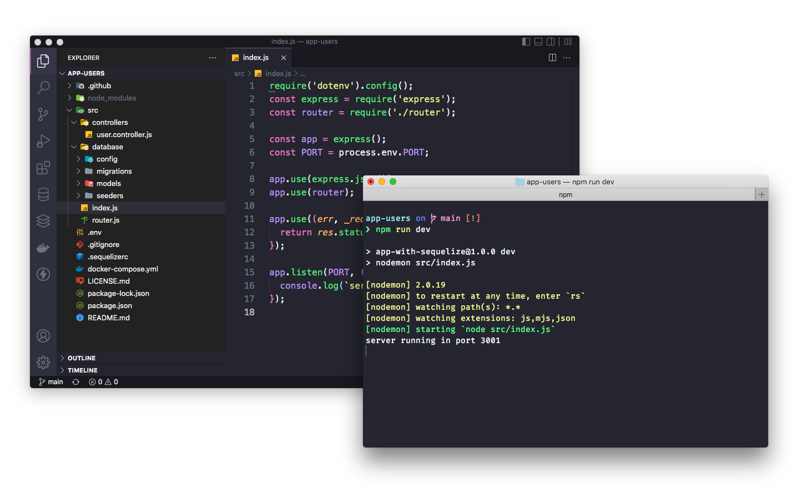

# App Users

<p align="center">
  
</p>

## Tecnologias

Esse projeto foi desenvolvido com as seguintes tecnologias:

- [Docker](https://www.docker.com/)
- [NodeJs](https://nodejs.org/)
- [Express](https://expressjs.com/)
- [Sequelize](https://sequelize.org/)

## Projeto

App Users é uma simples aplicação para gerenciamento de usuários.

## Como executar

- Faça o download do [Docker](https://www.docker.com/) para rodar o banco de dados
- Clone o repositório `git clone git@github.com:sergiovieirawebb/app-users.git`
- Rode o `npm install` para baixar as dependências
- Rode o `docker-composer up -d` para iniciar o banco de dados pelo docker
- Rode o `npm run database` para criar as tabelas do banco de dados
- Rode o `npm run dev` para iniciar a aplicação

Por fim, a aplicação estará disponível em `http://localhost:3001/users`

## Rotas da aplicação

- Dica: faça o download do [insomnia](https://insomnia.rest/) para acessar as rotas.

#### Busca todos usuários `GET /users`

> resposta da requisição
```json
[
  {
    "id": 1,
    "fullName": "Leonardo",
    "email": "leo@test.com",
    "phoneNum": "11942079043"
  },
  {
    "id": 2,
    "fullName": "Eduardo",
    "email": "edu@test.com",
    "phoneNum": "11942079043"
  }
]
```
#### Busca usuário pelo id `GET /users/id`


> resposta da requisição

```json
{
  "id": 1,
  "fullName": "Leonardo",
  "email": "leo@test.com",
  "phoneNum": "11942079043"
}
```
#### Busca usuário pelo id e email `GET /users/search/id?email=emailDoUsuario`

> resposta da requisição

```json
{
  "id": 1,
  "fullName": "Leonardo",
  "email": "leo@test.com",
  "phoneNum": "11942079043"
}
```

#### Adiciona um novo usuário `POST /users` 

> corpo da requisição

```json
{
  "fullName": "NewUser",
  "email": "newuser@test.com",
  "phoneNum": "11942079043"
}

```
> resposta da requisição

```json
{
  "id": 10,
  "fullName": "NewUser",
  "email": "newuser@test.com",
  "phoneNum": "11942079043"
}
```

#### Atualiza dados do usuário `PUT /users/id` 

> corpo da requisição

```json
{
  "fullName": "updateUser",
  "email": "updateEmail@test.com",
  "phoneNum": "1190398790"
}

```

> resposta da requisição

```json
{
  "message": "Usuário atualizado com sucesso!"
}
```

#### Remove um usuário `DELETE users/id`

> resposta da requisição

```json
{
  "message": "Usuário removido com sucesso!"
}
```

## Licença

Esse projeto foi criado por [Sérgio Vieira](https://www.linkedin.com/in/sergiovieirawebb/) - Desenvolvedor Back-end. E está sob a licença MIT, veja o arquivo [LICENSE](./LICENSE.md) para mais detalhes... :rocket:
